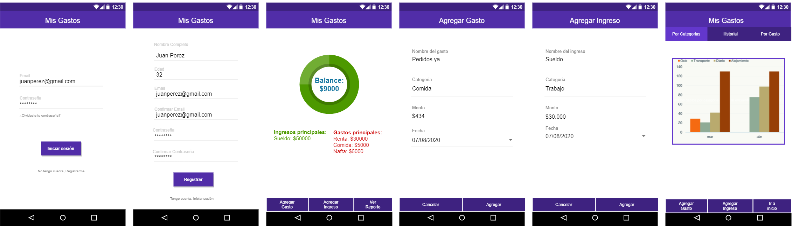

# Informe académico entrega 1
Fecha de entrega: 18-oct-2021

# Repositorio Git

- Creación y uso de repositorios locales y remotos 
- [Comandos Git ejecutados desde terminal y desde el IDE](gitdocs/gitdocs.md)

## Convenciones sobre el uso y nombramiento en git

A continuación pasamos a documentar cómo vamos a manejar el uso de git en el proyecto.

Sobre todo las buenas prácticas a utilizar y las convenciones de nombrado.

**En primer lugar tendremos dos categorizaciones de ramas**

### Ramas permanentes:

Dentro de las ramas permanentes contamos con las siguientes Main, QA y Dev. Cada una tiene un propósito específico y representa un estado de desarrollo del proyecto. De esta forma mantenemos el orden y podemos ver de forma clara el status de los cambios de una fase a la otra.

**Dev:** Dev o Development es la rama reservada para que los desarrolladores puedan comitear los últimos cambios, cuando todos los cambios de esta rama están listos se para el código a la rama de QA.

**QA:** En esta rama se procede a testear la calidad de código y levantar los issues que sean necesarios. Luego que el código pasa todas las pruebas se pasa a la rama Main.

**Main:** Esta rama contiene la última versión del proyecto la cual pasó por los estados anteriores, por lo tanto la versión que se encuentra en esta branch está lista para producción.

### Ramas temporales:

Estas ramas se crean para trabajar en algo específico por lo tanto la idea es mantener un nombrado claro sobre la tarea a llevar a cabo y categorizarla dentro de las siguientes opciones:

**Bug Fix (bug\_fix)**: El propósito de esta rama es reparar un error que se detectó en QA.

**Hot Fix (hot\_fix)**: El propósito de esta rama es reparar un error que se detectó en producción.

**Feature (feature)**: El propósito de esta rama es agregar un feature al proyecto.

## Nomenclatura para nombrar una rama

**ID de tarea - Tipo de rama - Responsable - breve descripción**

Un ejemplo sería el siguiente:

_687 - feature - ernesto\_speranza - log\_in\_usuario_

_367 - bug\_fix - diego\_caraballo - agregar\_gasto\_validar\_negativos_

[Referencias](investigacion/Referencias.md)
# Versionado

- Buenas prácticas de versionado
- Uso de ramas separadas de 'main'
- [Resumen de commits y evolución del proyecto](gitdocs/gitdocs.md)

# Elicitación

## Técnicas de elicitación utilizadas

Para nuestro proyecto decidimos realizar dos técnicas de elicitacion diferentes, Primero utilizamos Ingenieria Inversa sobre una aplicación que soluciona un problema similar al planteado en la consigna.

Elegimos Ingeniería Inversa porque nos da una base sobre la que comparar nuestra solución, podremos analizar qué funcionalidades deberíamos importar y cuales dejar de lado. También es una buena forma de conocer a nuestra “competencia”, sus fortalezas y debilidades. Con este estudio intentaremos imitar lo que consideremos bueno de la aplicación y dejar de lado lo no tan bueno.

Otra técnica utilizada es la entrevista, en este caso dirigida a nuestro cliente. Para que la aplicación funcione y tenga sentido se tiene que alinear con la necesidades de nuestro cliente y para conocer esas necesidades llevamos a cabo una entrevista con el. Nuestro objetivo aquí es obtener la información clave (sus necesidades) que nos guiará durante el proyecto.

Por ultimo realizamos user personas, que son arquetipos que representan a los diferentes tipoos de usuarios que podrian interactuar con nuestra aplicacion. Creemos que esta tecnica es vital ya que nos da una referencia a la hora de pensar quien sera el usuario promedio y recordar que nuestro objetivo es hacer una aplicacion que este dirigida a esa persona y le tiene que dar valor a esa misma persona.

Una vez realizadas estas investigaciones y el modelo conceptual del problema, tenemos lo que necesitamos para comenzar con la especificacion.

- [Evidencia de actividades de investigación](investigacion/README.md)
- [Referencias a fuentes de información](investigacion/Referencias.md)

## Caracterización de usuarios: User Personas

A continuacion se detallan los 2 User Personas que definimos, de manera de tener representaciones de cuales podrian ser nuestros potenciales clientes.

## Modelo conceptual del problema

A continuación presentamos el modelo conceptual así como también las distintas versiones que fuimos generando de manera de mostrar la evolución del mismo.

# Especificación

## Requerimientos funcionales

RF1: El usuario deberá registrarse en la aplicación ingresando nombre, email, password y edad. 
Prioridad: Obligatorio

RF2: El usuario deberá loguearse con su email y password en la aplicación. 
Prioridad: Obligatorio

RF3: El usuario tendrá la posibilidad de modificar su contraseña. 
Prioridad: Importante

RF4: El usuario podrá registrar gastos en el sistema, cada gasto tendrá una categoría asignada por el usuario. 
Prioridad: Obligatorio

RF5: El usuario podrá registrar ingresos en el sistema, cada ingreso tendrá una categoría asignada por el usuario. 
Prioridad: Obligatorio

RF6: El usuario deberá poder escanear facturas de gastos para ingresar en el sistema. 
Prioridad: No implementable

RF7: El usuario debe poder setear un gasto como algo recurrente de manera mensual. 
Prioridad: Deseable

RF8: El sistema deberá generar sugerencias personalizadas para el usuario a partir de sus ingresos y gastos. 
Prioridad: Deseable

RF9: El usuario deberá poder determinar objetivos financieros en un marco temporal. 
Prioridad: Importante

RF10: El sistema generará reportes de gastos separados por categorías. 
Prioridad: Obligatorio

RF11: El sistema llevará un balance contable entre gastos e ingresos para el usuario. 
Prioridad: Obligatorio

RF12: El usuario podrá ver el estado de sus finanzas en una gráfica. 
Prioridad: Importante

## Requerimientos no funcionales

RNF1: Toda funcionalidad del sistema debe responder al usuario en menos de 5 segundos. 
Prioridad: Deseable

RNF2: Los datos modificados deben ser actualizados para el usuario en menos de dos segundos. 
Prioridad: Deseable

RNF3: El tiempo de aprendizaje del sistema por un usuario deberá ser de menos de una hora. 
Prioridad: Deseable

RNF4: Se debe informar al usuario de los errores que suceden, de forma que el usuario entienda el error. 
Prioridad: Importante

RNF5: La interfaz de usuario debe ser web / mobile (responsive). 
Prioridad: Obligatorio

RNF6: La interfaz de usuario debe estar en su completitud en el idioma español. 
Prioridad: Obligatorio

RNF7: La aplicación se desarrollará utilizando el sistema de repositorios de GitHub. 
Prioridad: Obligatorio

RNF8: Las pruebas de software se realizan con Test unitario Jest. 
Prioridad: Obligatorio

RNF9: La documentación estará en formato Markdown. 
Prioridad: Obligatorio

RNF10: Para el desarrollo se utilizará la IDE Visual Studio Code 1.61. 
Prioridad: Obligatorio

RNF11: La aplicación debe ser desarrollada usando las siguientes tecnologías: Javascript, Node.js, Material Design, HTML5 y CSS. 
Prioridad: Obligatorio

RNF12: El código debe pasar la verificación de reglas estándar de ESlint. 
Prioridad: Deseable

RNF13: La aplicación será desarrollada para ser utilizada en Google Chrome, versión 94.0.4606.71 en adelante para windows y versión 94.0.4606.52 en adelante para iOS. 
Prioridad: Obligatorio

RNF14: La aplicación se lanzará para ser utilizada en Montevideo, Uruguay. 
Prioridad: Deseable

RNF15: La aplicación se deberá llamar “MisGastos”. 
Prioridad: Obligatorio

RNF16: El color primario será Deep Purple 700 y el secundario Teal 700. 
Prioridad: Obligatorio

RNF17: El font utilizado en la aplicación será Roboto. 
Prioridad: Obligatorio

RNF18: Utilizar una gama de colores amigable con el daltonismo. 
Prioridad: Deseable

RNF19: El sistema debe respetar las buenas prácticas de accesibilidad y guiarse por las Heurísticas de Nielsen en el diseño. 
Prioridad: Deseable

- [User Stories](userstories/README.md)
- [Bocetos de IU](bocetosiu/README.md)
- [Link a la version final del prototipo](https://viewer.diagrams.net/?tags=%7B%7D&highlight=0000ff&edit=_blank&layers=1&nav=1&title=Boceto%20UI#Uhttps%3A%2F%2Fdrive.[…]e%26export%3Ddownload)

# Validación y verificación

- Verificar la especificación 

- [Validar la solución con personas no involucradas en el proyecto](bocetosiu/README.md)

Para la validación de nuestro prototipo, les enviamos nuestro prototipo a 2 personas.
En el caso de la primera de ellas, nos comento que en líneas generales la veía bien y que no le haría ninguna mejora en primera instancia.
En el caso de la segunda, nos hizo el comentario de que los botones que se encuentran debajo en cada vista, no queda claro que si lo son, algo que puede llevar a confusión para el usuario.
Por lo que a raíz de este comentario tomamos la decisión en la siguiente iteración de nuestro prototipo de incluir una separación entre cada uno de ellos de manera de que sea más claro que son botones.

A continuación se detalla cual es la versión final, luego de realizadas las mejoras propuestas.

# Reflexión

### Detalle del trabajo individual: 
[Ernesto](reflexiones/ernesto.md) 
[Diego](reflexiones/diego.md) 
[Francisco](reflexiones/francisco.md) 

## Técnicas aplicadas y aprendizajes

Para gestionar las distintas tareas del obligatorio decimos usar Trello.

### _¿Que es Trello?_

Trello es una herramienta enfocada en gestión de proyectos que facilita la colaboración, en donde se puede definir un tablero, que contiene una lista de tareas definidas en tarjetas.

### _¿Que ventajas nos da?_

El uso de esta herramienta nos permite visibilizar de una manera clara las distintas tareas a realizar para el obligatorio.
A su vez podemos saber en qué tarea estaba trabajando cada uno de nosotros, cuales están pendientes y cuales estarían terminadas, es decir, de una manera rápida pudimos ver el estado de las distintas etapas y eso nos da la posibilidad de realizar ajustes para poder cumplir con los tiempos de entrega.

### _¿Como organizamos el tablero?_

Nuestro tablero lo definimos usando 3 columnas para reflejar el estado de cada una de las tareas:

**TODO:** Donde inicialmente definimos cada tarea en una tarjeta. A su vez cada vez que uno de nosotros terminaba una, podía elegir una de las existentes en dicha columna, asignarla y comenzar a trabajar.

**DOING:** Columna que muestra que las tareas bajo esta columna están siendo trabajadas por alguno/s de los integrantes del equipo.

**DONE:** Las tarjetas en esta columna ya están completadas.

A continuación a modo de ejemplo ilustramos cómo quedó compuesto el tablero:

