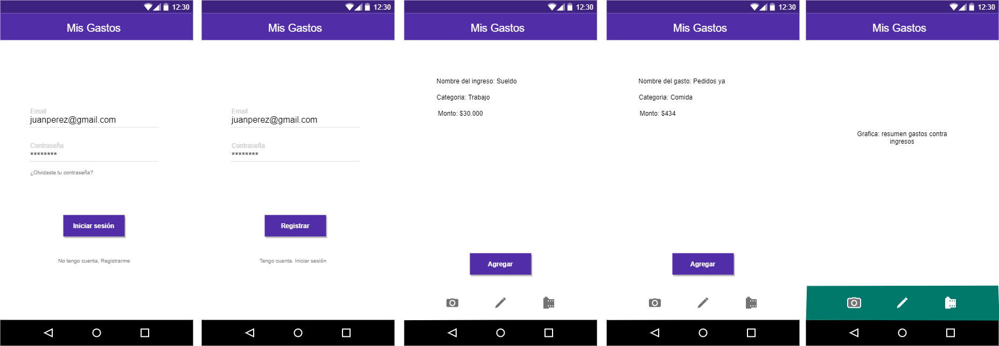
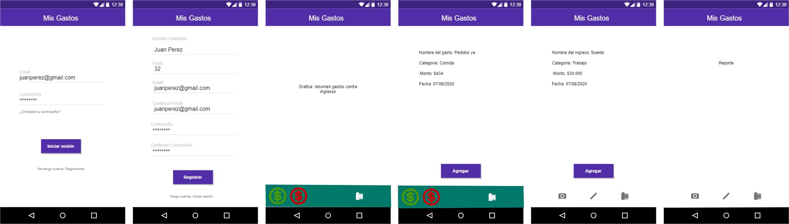
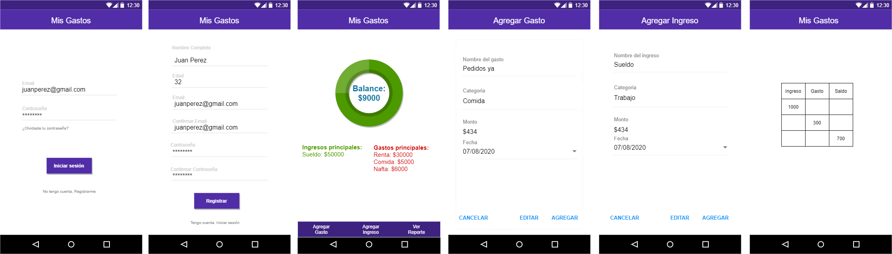
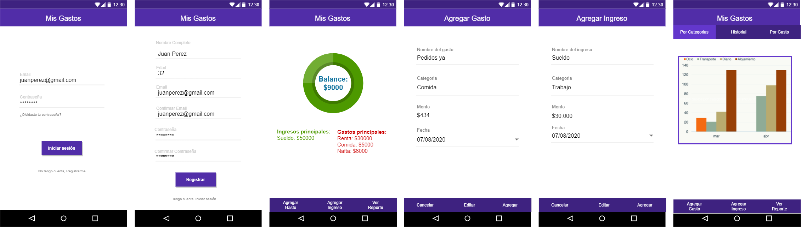
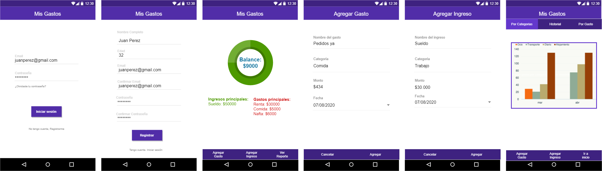

# Bocetos de interfaz de usuario

### Iteración Uno
En la primer iteración maquetamos las vistas de mayor importancia de la app.
Usamos placeholders para maquetar los valor que podriamos necesitar en cada paso. 
Definimos la estetica en la que nos ibamos a basar en el login.

### Iteración Dos
En la segunda iteración trabajamos en el registro de usuario asi como tambien construir 
una barra inferior la cual permitiera al usuario acceder a las funcionalidades.
Como no logramos conseguir inconos que nos convencieran esteticamente pasamos a trabajar con botones

### Iteración Tres
En la iteración tres pasamos a intentar unificar toda la estetica de las vistas.
Incorporamos botones en vez de la barra con iconos y probamos el registro de ingreso y gasto.

### Iteración Cuatro
Ya con una estetica unificada, pulimos algunos detalles y continuamos trabajando en la vista de reporte.
Probamos mantener el mismo criterio para la barra inferior, la cual aparece casi en todas las vistas de la aplicacion.

### Iteración Cinco
En la quinta iteracion removimos botones que entendiamos que eran redundantes o inutiles para mejorar la experiencia de usuario.
Tambien hicimos los retoques finales a nivel navegacion antes de llevarlo a validar con personas exteriores al proyecto

### Iteración Final
Luego de validar con personas exteriores al proyecto modificamos la visualizacion de los botones inferiores para que fuera mas claro su uso.

