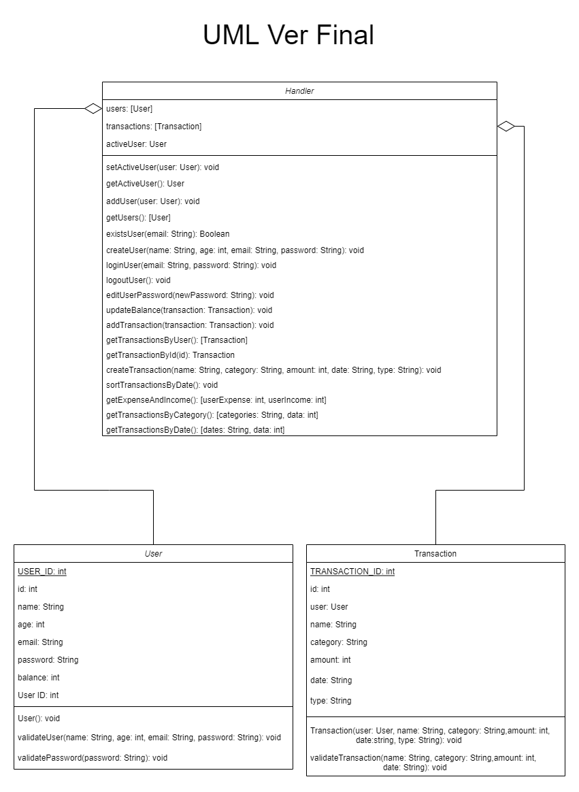
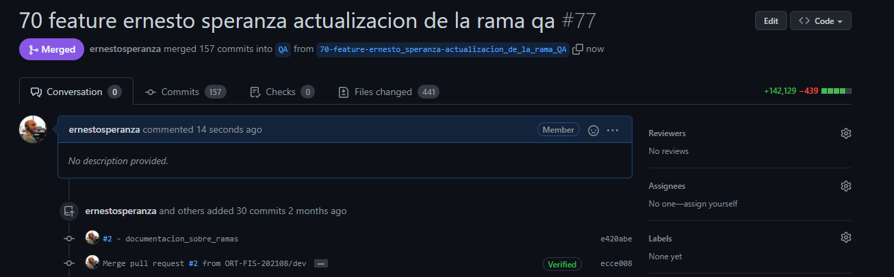

# Informe académico entrega 2
Fecha de entrega: 29-nov-2021

# Construcción

## UML final del sistema
Decidimos armar un UML del sistema para planificar en forma correcta los metodos que iba a necesitar cada funcionalidad.
De esta forma logramos un diseño consistente del dominio el cual funciona de forma independiente de la interfaz.

[Proceso de desarrollo del UML](docs/uml/README.md) 

## Implementación de funciones principales (sin la necesidad de persistencia de datos)

[Demos de las funcionalidades en desktop y mobile](docs/demo/README.md) 

## Configuración de plataforma tecnológica para desarrollo y producción

## Documentación del uso de librerías externas (package.json)

# Interfaz de usuario

## Interfaz de usuario web / mobile (responsive)

## Página única con navegación entre secciones

## Implementación: Material Design Web Components

## Aplicar un sistema de diseño y principios de usabilidad

## Cumplimiento de estándar de accesibilidad WCAG

## Seguir especificación de estilo
[Especificaciones de estilo](docs/estilo-estandares/README.md)

# Codificación

## IDE Visual Studio Code: configuración común del equipo
#### Para la configuracion del IDE utilizamos lo siguiente:
- node v14.17.4
- Visual Studio Code 1.62.3
- npm 6.14.14
- eslint: 8.2.0
- eslint-config-google: 0.14.0
- git version 2.33.0
- moment: 2.29.1
- jest: 26.6.3
- chart.js: 3.6.0
- material-components-web: 11.0.0
- Extensión ESLint

## Estándares de codificación Google (HTML, CSS, JavaScript)
[Estándares de codificación Google](docs/estilo-estandares/README.md)

## Buenas prácticas de OOP: separación de lógica e interfaz

## Análisis estático de código: mostrar reducción de problemas
[Análisis estatico de código](docs/estilo-estandares/README.md)
# Test unitario

## Test unitarios en Jest

Durante el desarrollo de la aplicación fuimos realizando pruebas unitarias utilizando jest para saber que funcionaba de forma correcta con certeza y ahorrarnos hacer las pruebas en runtime. También si cambiamos algo del funcionamiento de la aplicación sabíamos con certeza si algo de la app se rompía. Conseguimos llegar al 100% de cobertura de código y luego de llegar a esa meta continuamos agregando pruebas para los casos límites de las funciones.

Para organizar los test creamos una carpeta dentro de dominio llamada tests y creamos una clase de prueba para cada clase del dominio. Luego utilizamos los estandares vistos en clase para desarrollar los tests.

## 100% cobertura en clases de dominio

| En la semana previa a la entrega se debe congelar el desarrollo (22-nov-2021).
A partir de este punto solo se realizan actividades de test de sistema, reporte de issues y generación del informe académico.

# Test de sistema

## Realizar test de sistema en un entorno separado del desarrollo
Generamos una rama separada de dev y main con una copia del código del code freeze 
todas las pruebas y verificaciones así como la documentación posterior al code freeze se realizarion sobre esa rama.

## Generar casos de prueba aplicando técnica partición equivalente

### Pruebas de valores limite

### Prueba Log In

[Prueba Log In](docs/testing-valores-limite/tvl-login.md)

### Prueba Ingreso

[Prueba Agregar Ingreso](docs/testing-valores-limite/tvl-agregar-ingreso.md)

### Prueba Gasto

[Prueba Agregar Gasto](docs/testing-valores-limite/tvl-agregar-gasto.md)

## Detallar sesiones de prueba exploratoria

[Sesion Exploratoria Reportes](docs/sesion-testing-exploratorio/reporte.md)

# Reporte de issues

## Reportar issues (bugs, improvements, missing features) en GitHub 

## Aplicar buenas prácticas de reporte de issues
[Formato de reporte de issues](docs/issues/README.md) 

## Definir labels para tipos de issue y niveles de severidad
[Definición de labels y severidad](docs/issues/README.md) 

## Dejar issues abiertos para correcciones o mejoras futuras

## Sumarizar número de issues reportados por tipo

## Realizar una evaluación global de la calidad

# Reflexión

## Detalle del trabajo individual

## Técnicas aplicadas y aprendizajes
