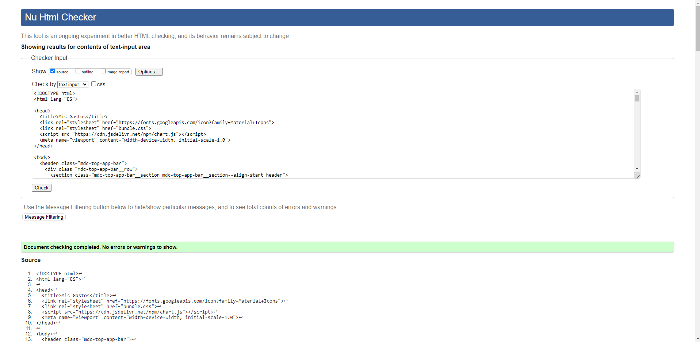
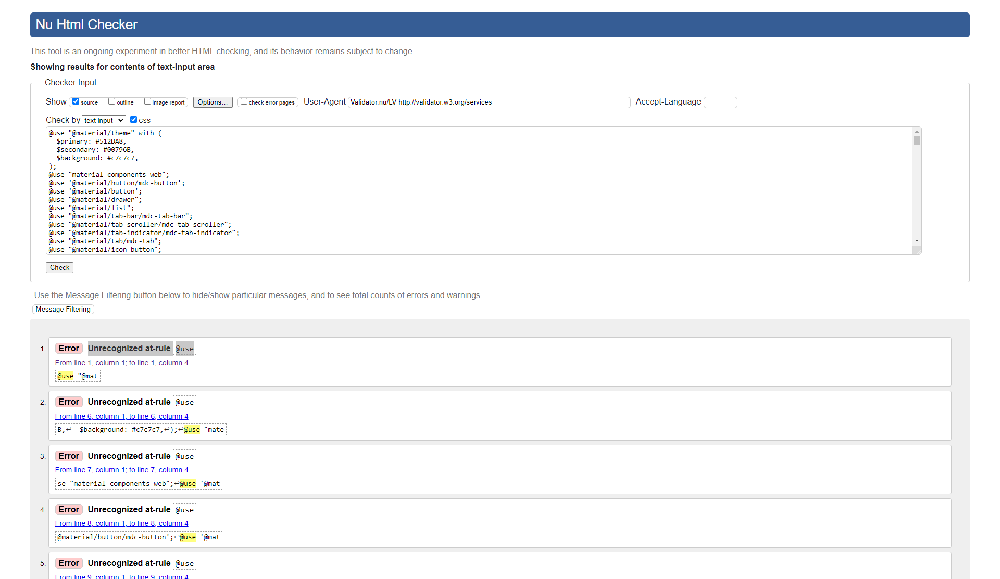
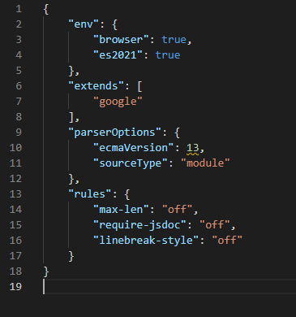

# Especificaciones de estilo 

Especificación de estilo
https://material.io/resources/color 

- Nombre de la app: MisGastos
- Colors primary: Deep Purple 700, secondary: Teal 700
- Font: Roboto
- Icons: filled

# Estándares de codificación y Analisis estático de código

## Estándares de codificación
Para verificar los estándares de codificación usamos varias herramientas, la primer fue el análisis estático de código instalando ESLint.
Para esto elegimos la configuración de estilo espedifica de Google.
Además usamos el validado de código de w3.org para verificar tanto el HTML como el CSS (ya que el JS estaba siendo revisado por ESLint).

### Prueba del HTML check exitoso

### Prueba del CSS check exitoso
En el caso del CSS el conflicto que no pudimos resolver es que define el @use como un error, en este caso decidimos tomar las buenas paratácticas de material design como prioritarias e ignorar ese error.

### Conclusiones sobre el proceso de revisión
En el proceso de revisión encontramos varios errores los cuales pudimos ajustar antes de llegar a la versión definitiva, como por ejemplo:
- Sections sin H1 
- Multiple uso de la etiqueta main
- Algunas etiquetas div sin cerrar
- Algunas etiquetas section sin cerrar 
- Mínimos ajustes en las clases de CSS

## Analisis estático de código
El uso de ESLint nos permitió a todo el grupo escribir código de forma consistente vinculado a las reglas de estilo de Google.
Aunque nos tomamos la libertad de anular algunas reglas por que entendimos que no eran necesarias y entorpecían el flujo de trabajo del proyecto.

- max-len: deshabilitamos la limitación de caracteres por linea ya que no nos permitía trabajar con comodidad.

- requiere-jsdoc: basandonos en el principio que el buen código se documenta a si mismo, decidimos remover el requerimiento mandatorio, dejando criterio libre al programador si entendía que la función necesitaba comentarios a forma de documentación.

- linebreak-style: decidimos deshabilitarlo ya que no lo encontramos relevante para el proyecto y cada vez que hacíamos un commit github terminaba cambiando todo el linebreak-style al modelo anterior.

Para configurar ESLint con los estándares de google tuvimos que instalar eslint-config-google.

### El setup de ESLint 
