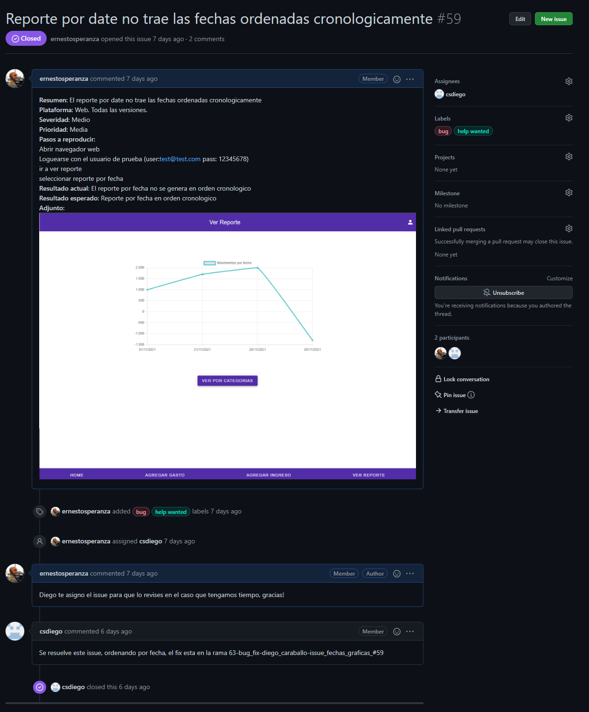

# Formato para issues

## _Para reportar los issues usamos el siguiente template como formato:_

**Resumen**: Login desde dispositivo móvil lanza error 500

**Plataforma**: Android y iPhone. Todas las versiones

**Severidad**: Bloqueante

**Prioridad**: Alta

**Pasos a reproducir**:

- Abrir navegador web
- Ingresar al sitio de prueba
- Ingresar email y contraseñas de usuario válido
- Presionar en el botón Login
**Resultado actual**: Error 500 aparece en la pantalla del dispositivo

**Resultado esperado**: Usuario puede loguearse correctamente, se despliega la pantalla principal del sitio

**Adjunto**: (Puede ser imagen de la consola mostrando el error 500 por ejemplo)

## _Un ejemplo de esto seria:_

# Criterio para las etiquetas

Tuvimos que definir criterios para 2 etiquetas **Severidad** y **Prioridad**.

El alcance es el siguiente:

## **Severidad**
- Critico: Involucra un aspecto clave del producto o afecta al usuario de forma directa, requiere atención urgente.
- Alto: Involucra un aspecto clave del producto o afecta al usuario de forma directa pero puede ser trabajado para la próxima versión.
- Medio: Involucra bugs no críticos o enhancements relevantes, trabajar para la próxima versión.
- Bajo: Involucra enhancements no relevantes o fallas menores. 
- Cosmético: Corresponde a mejoras estéticas o de la interfaz, interpretar la necesidad en conjunto con la prioridad del issue.

## **Prioridad**
- Alta: Es un issue que requiere ser trabajado lo antes posible, dejar todo lo de prioridad menor y enfocarse en esto
- Media: Es un issue que es deseable que se resuelva, pero siempre priorizar los de prioridad alta.
- Baja: Es un issue menor con poca importancia, en el caso de tener recursos o que el tiempo de resolución sea reducido trabajarlo, de lo contrario ignorarlo.