| MISIÓN | Comprobar valores inválidos/válidos en los distintos campos del formulario de creación de un gasto |
| --- | --- |
| INICIO | 15:21 27.11.2021 |
| TESTER | Diego Caraballo |
| ESTRUCTURA DE DIVISIÓN | 
| DURACIÓN: | Corta (30 min) |
DISEÑO Y EJECUCIÓN DE PRUEBAS: | 40% |
INVESTIGACIÓN Y REPORTES DE DEFECTOS: | 60% |
ARMADO DE LA SESIÓN (Setup - Configuración): | 0% |
OBJETIVO vs. OPORTUNIDAD:| 100% - 0% |
| ARCHIVOS DE DATOS | ------- |
| Defectos y enhancements | #1
| Inconvenientes | No aplica |
| Notas de prueba |
- Ingresamos al sitio: http://localhost:8080/ donde se ejecuta la aplicación Mis gastos de manera local
- Creo un usuario con los siguientes datos:
- nombre: diego
- edad: 25
- email: diegocs05@gmail.com
- confirmar email: diegocs05@gmail.com
- contraseña: 12345678
- confirmar contraseña: 12345678
- Ingresamos al sitio: [http://localhost:8080/](http://localhost:8080/) donde se ejecuta la aplicación Mis gastos de manera local.

**P1** 

- Selecciono Agregar gasto en el menú inferior
- Click en botón agregar, con todos los campos vacíos.
- Se visualiza mensaje de error informando que el primer campo (nombre) no es válido

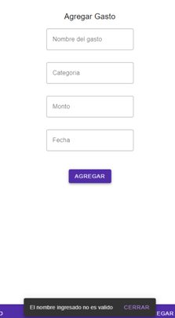

**P2** 

- Se agrega en el campo nombre solo números: 123456
- Click en botón agregar
- Se visualiza mensaje de error informando que el primer campo (nombre) no es válido

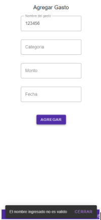

**P3** 

- Se agrega en el campo nombre solo caracteres especiales: //..--
- Click en botón agregar
- Se visualiza mensaje de error informando que el primer campo (nombre) no es válido

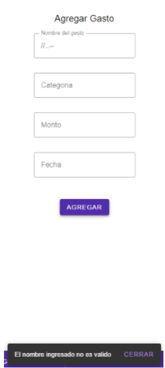

**P4** 

- Se agrega en el campo nombre solo espacios
- Click en botón agregar
- Se visualiza mensaje de error informando que el primer campo (nombre) no es válido

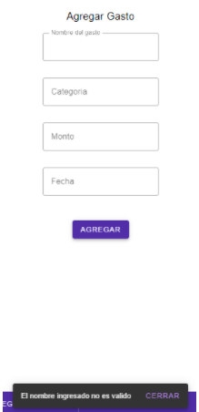

**P5** 

- Se agrega en el campo nombre un valor válido: ‘agua’
- Click en botón agregar
- Se visualiza mensaje de error informando que la categoría no es válida.

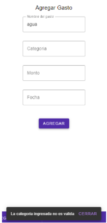

**P6** 

- Se agrega en el campo nombre un valor válido: ‘agua’
- Se agrega en el campo categoría solo números: 12345
- Click en botón agregar
- Se visualiza mensaje de error informando que la categoría no es válida.

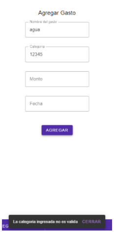

**P7** 

- Se agrega en el campo nombre un valor válido: ‘agua’
- Se agrega en el campo categoría caracteres especiales: ../*++
- Click en botón agregar
- Se visualiza mensaje de error informando que la categoría no es válida.

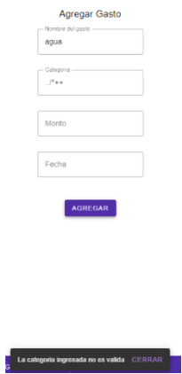

**P8** 

- Se agrega en el campo nombre un valor válido: ‘agua’
- Se agrega en el campo categoría solo espacios
- Click en botón agregar
- Se visualiza mensaje de error informando que la categoría no es válida.

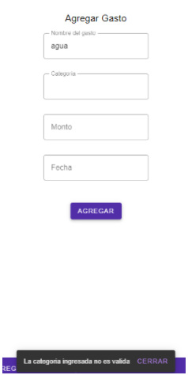

**P9** 

- Se agrega en el campo nombre un valor válido: ‘agua’
- Se agrega en el campo categoría un valor válido: ‘bebida’
- Click en botón agregar
- Se visualiza mensaje de error informando que el monto no es válido.

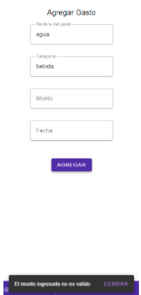

**P10** 

- Se agrega en el campo nombre un valor válido: ‘agua’
- Se agrega en el campo categoría un valor válido: ‘bebida’
- Se agrega un monto negativo: -1
- Click en botón agregar
- Se visualiza mensaje de error informando que el monto no es válido.

- ENHANCEMENT: #1 Cuando un campo es invalido se debería marcar en rojo como en el del monto.

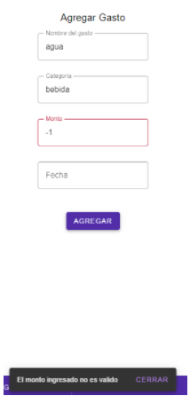

**P11** 

- Se agrega en el campo nombre un valor válido: ‘agua’
- Se agrega en el campo categoría un valor válido: ‘bebida’
- Se agrega un monto: 0
- Click en botón agregar
- Se visualiza mensaje de error informando que el monto no es válido.

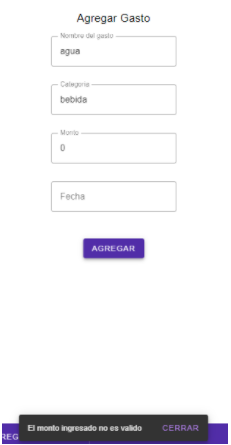

**P12** 

- Se agrega en el campo nombre un valor válido: ‘agua’
- Se agrega en el campo categoría un valor válido: ‘bebida’
- Se agrega un monto: e
- Click en botón agregar
- Se visualiza mensaje de error informando que el monto no es válido.

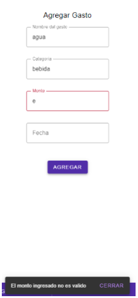

**P13** 

- Se agrega en el campo nombre un valor válido: ‘agua’
- Se agrega en el campo categoría un valor válido: ‘bebida’
- Se agrega un monto válido: 100
- Click en botón agregar
- Se visualiza mensaje de error informando que la fecha no es esta en un formato válido

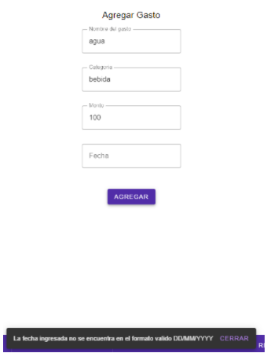

**P14** 

- Se agrega en el campo nombre un valor válido: ‘agua’
- Se agrega en el campo categoría un valor válido: ‘bebida’
- Se agrega un monto válido: 100
- Se agrega en el campo fecha solo espacios
- Click en botón agregar
- Se visualiza mensaje de error informando que la fecha no es esta en un formato válido

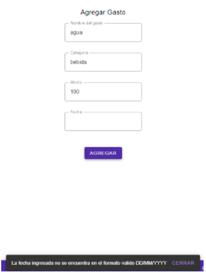

**P15** 

- Se agrega en el campo nombre un valor válido: ‘agua’
- Se agrega en el campo categoría un valor válido: ‘bebida’
- Se agrega un monto válido: 100
- Se agrega en el campo fecha solo caracteres especiales: ??++//--
- Click en botón agregar
- Se visualiza mensaje de error informando que la fecha no es esta en un formato válido

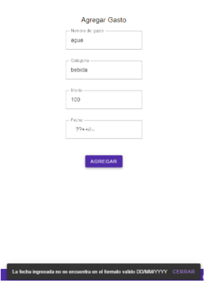

**P16** 

- Se agrega en el campo nombre un valor válido: ‘agua’
- Se agrega en el campo categoría un valor válido: ‘bebida’
- Se agrega un monto válido: 100
- Se agrega en el campo fecha solo números: 22334455
- Click en botón agregar
- Se visualiza mensaje de error informando que la fecha no es esta en un formato válido

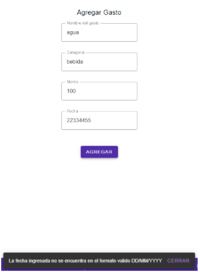

**P17** 

- Se agrega en el campo nombre un valor válido: ‘agua’
- Se agrega en el campo categoría un valor válido: ‘bebida’
- Se agrega un monto válido: 100
- Se agrega en el campo fecha correcta pero un formato invalido (dia): 1/11/2021
- Click en botón agregar
- Se visualiza mensaje de error informando que la fecha no es esta en un formato válido

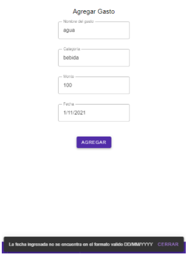

**P18** 

- Se agrega en el campo nombre un valor válido: ‘agua’
- Se agrega en el campo categoría un valor válido: ‘bebida’
- Se agrega un monto válido: 100
- Se agrega en el campo fecha correcta pero un formato invalido (mes): 01/1/2021
- Click en botón agregar
- Se visualiza mensaje de error informando que la fecha no es esta en un formato válido

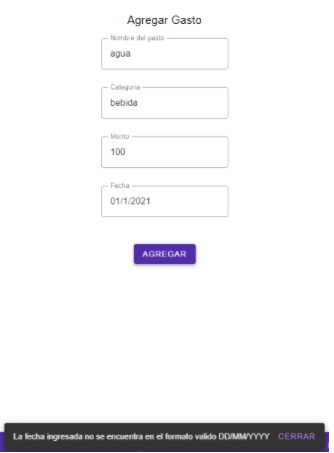

**P19** 

- Se agrega en el campo nombre un valor válido: ‘agua’
- Se agrega en el campo categoría un valor válido: ‘bebida’
- Se agrega un monto válido: 100
- Se agrega en el campo fecha correcta pero un formato invalido (mes y una letra): 01/1a/2021
- Click en botón agregar
- Se visualiza mensaje de error informando que la fecha no es esta en un formato válido

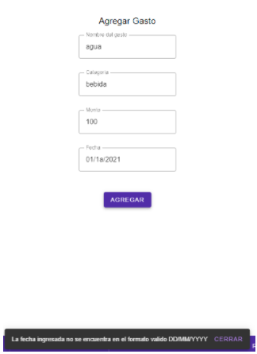

**P20** 

- Se agrega en el campo nombre un valor válido: ‘agua’
- Se agrega en el campo categoría un valor válido: ‘bebida’
- Se agrega un monto válido: 100
- Se agrega en el campo fecha incorrecta (último día del mes pasado: 31/10/2021
- Click en botón agregar
- Se visualiza mensaje de error informando que la fecha no es esta en el mes y año actual

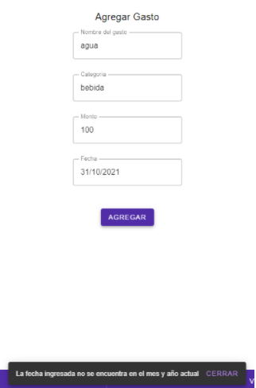

**P21** 

- Se agrega en el campo nombre un valor válido: ‘agua’
- Se agrega en el campo categoría un valor válido: ‘bebida’
- Se agrega un monto válido: 100
- Se agrega en el campo fecha incorrecta (primer día del mes próximo: 01/12/2021
- Click en botón agregar
- Se visualiza mensaje de error informando que la fecha no es esta en el mes y año actual

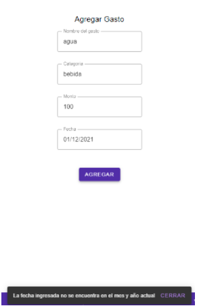

**P22** 

- Se agrega en el campo nombre un valor válido: ‘agua’
- Se agrega en el campo categoría un valor válido: ‘bebida’
- Se agrega un monto válido: 100
- Se agrega en el campo fecha incorrecta (año pasado): 01/11/2020
- Click en botón agregar
- Se visualiza mensaje de error informando que la fecha no es esta en el mes y año actual

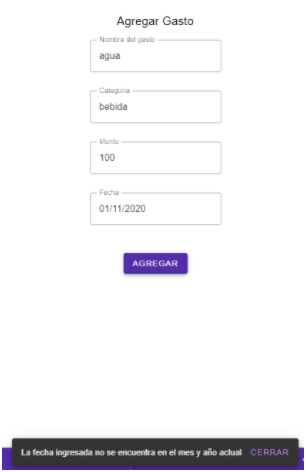

**P23** 

- Se agrega en el campo nombre un valor válido: ‘agua’
- Se agrega en el campo categoría un valor válido: ‘bebida’
- Se agrega un monto válido: 100
- Se agrega en el campo fecha incorrecta (año próximo): 01/11/2022
- Click en botón agregar
- Se visualiza mensaje de error informando que la fecha no es esta en el mes y año actual

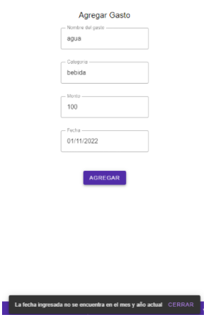

**P24** 

- Se agrega en el campo nombre un valor válido: ‘agua’
- Se agrega en el campo categoría un valor válido: ‘bebida’
- Se agrega un monto válido: 100
- Se agrega en el campo fecha correcta: 01/11/2021
- Click en botón agregar
- Se visualiza mensaje informando que el gasto se agregó exitosamente y se vacían los campos.

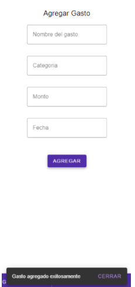