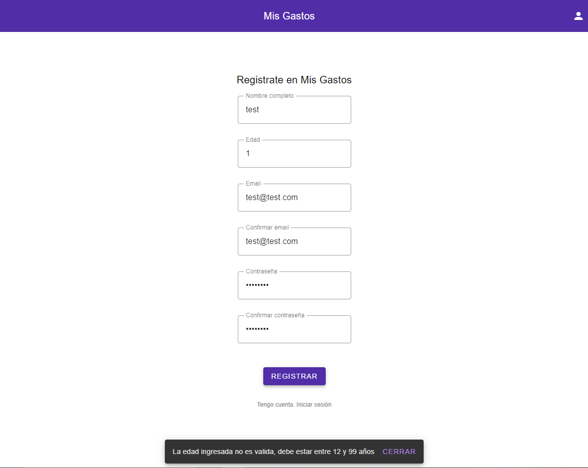
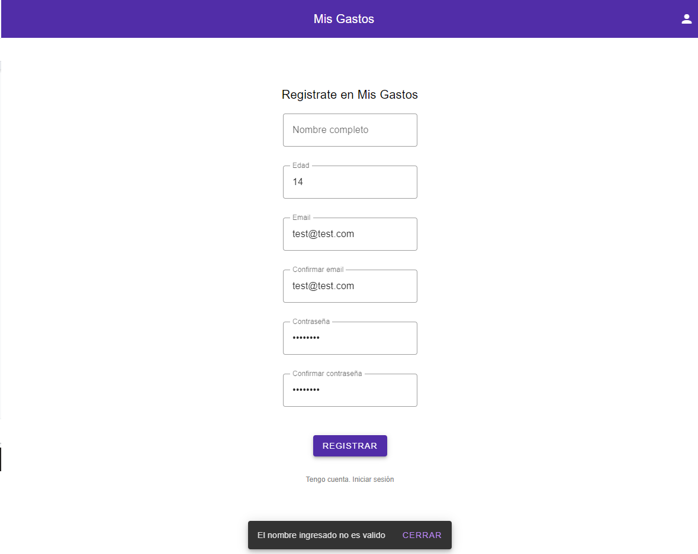
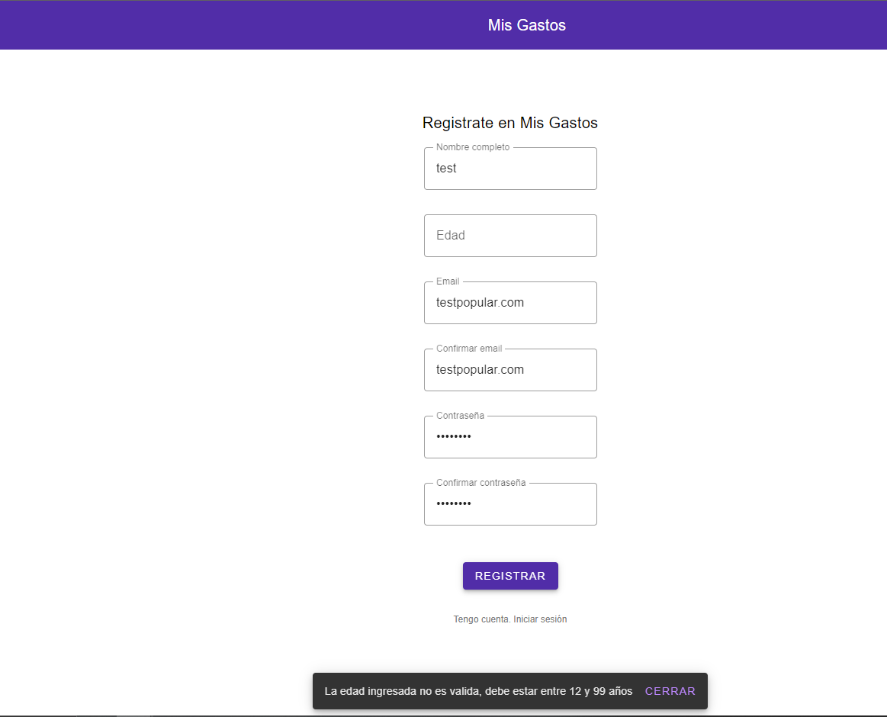
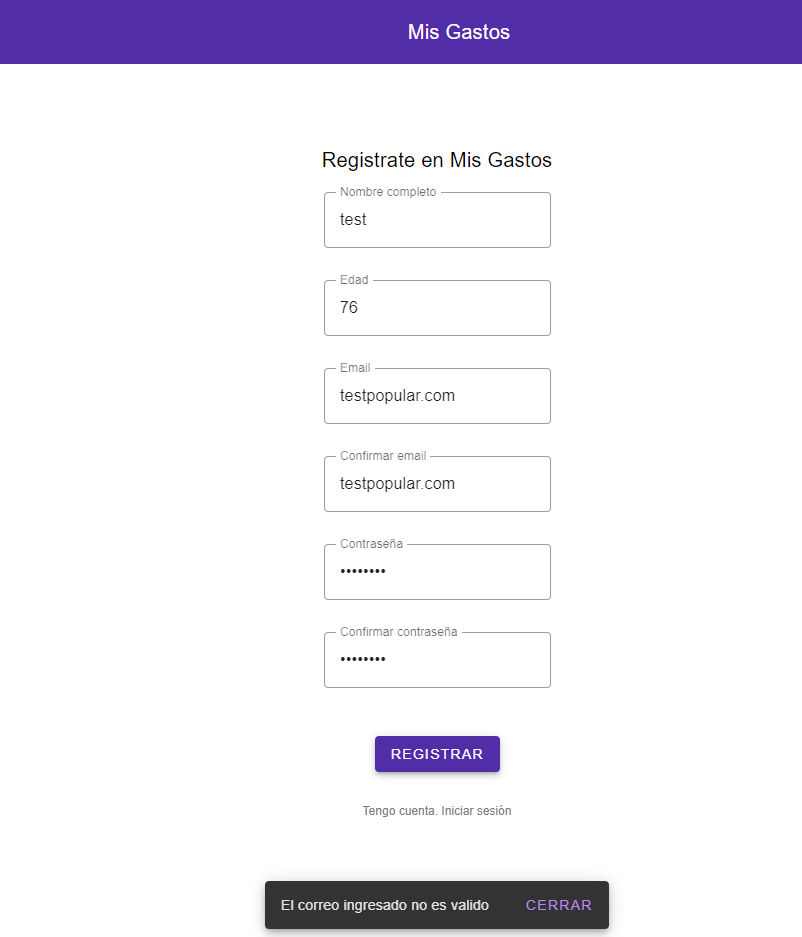
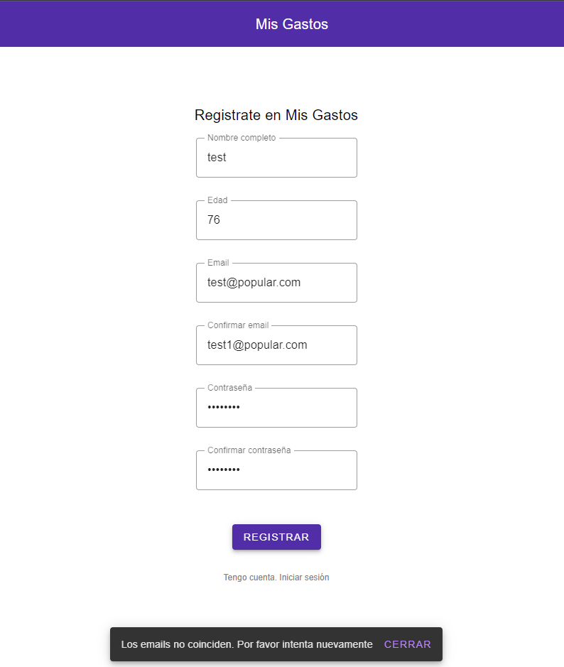
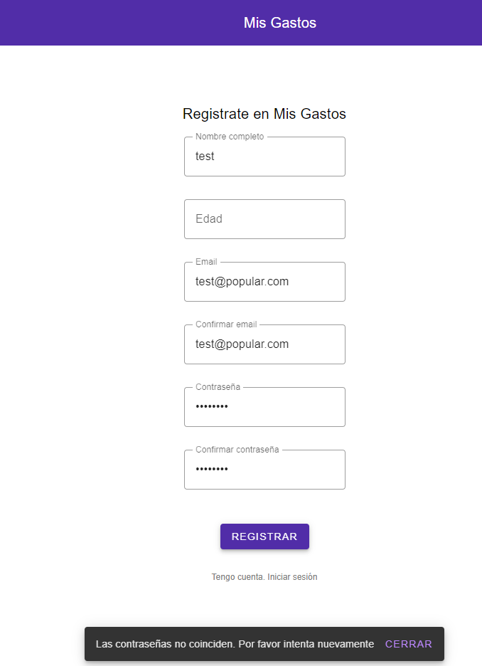
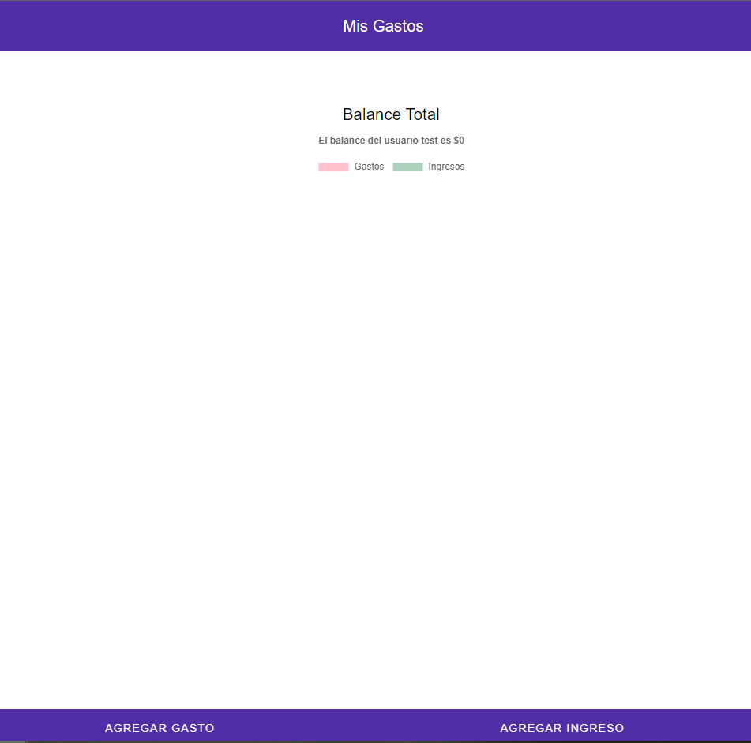

| MISIÓN | Comprobar valores inválidos/válidos en los distintos campos del formulario de creación de un gastoComprobar el correcto funcionamiento del tab reporte, enfocándonos en la gráfica. |
| --- | --- |
| INICIO | 11:10 28.11.2021 |
| TESTER | Francisco Lopez |
| ESTRUCTURA DE DIVISIÓN | DURACIÓN: Corta (30 min) DISEÑO Y EJECUCIÓN DE PRUEBAS: 40% INVESTIGACIÓN Y REPORTES DE DEFECTOS: 60% ARMADO DE LA SESIÓN (Setup - Configuración): 0% OBJETIVO vs. OPORTUNIDAD: 100% - 0% |
| ARCHIVOS DE DATOS | ------- |
| Notas de prueba | Ingresamos al sitio: [http://localhost:8080/](http://localhost:8080/) donde se ejecuta la aplicación Mis gastos de manera local Creo un usuario con los siguientes datos: nombre: fran edad: 24 email: flopez[@gmail.com] confirmar email: flopez[@gmail.com] contraseña: 123123123 confirmar contraseña: 123123123 Luego ingresamos un gasto con los siguientes datos: nombre: pizza categoría: comida monto: 350 fecha: 28/11/2021 Luego ingresamos un ingreso con los siguientes datos: nombre: sueldo categoría: trabajo monto: 10000 fecha: 03/11/2021 Luego ingresamos un gasto con los siguientes datos: nombre: reparacion coche categoría: transporte monto: 3000 fecha: 07/11/2021 Luego ingresamos un gasto con los siguientes datos: nombre: supermercado categoría: comida monto: 2500 fecha: 09/11/2021 Luego ingresamos un gasto con los siguientes datos: nombre: ración mascota categoría: mascota monto: 1500 fecha: 06/11/2021 Luego ingresamos un gasto con los siguientes datos: nombre: battlefield 2042 categoría: ocio monto: 2500 fecha: 17/11/2021   P1 Selecciono &quot;Ver Reportes&quot; en el menú inferior Se visualiza el tab de ver reportes, y se muestran las categorías en orden de ingreso al sistema y muestran el balance de cada una, comparándolas con las demás categorías.     P2 Selecciono el boton &quot;Ver Historico&quot; Se muestra la gráfica Histórica que nos muestra cuánto gastamos o ganamos cada día, siempre comparando con el resto de transacciones así podemos tener una idea de en qué momentos del mes solemos gastar más.     P3 Seleccionamos la opción home en el menú inferior se visualiza la ventana &quot;home&quot; y se muestra la gráfica mostrándonos nuestro balance general, comparando ingresos y gastos.  
 |
| Defectos y enhancements | #1 |
| Inconvenientes | No aplica |

| MISIÓN | Validar el correcto funcionamiento del sign in |
| --- | --- |
| INICIO | 18:00 28.11.2021 |
| TESTER | Ernesto Speranza |
| ESTRUCTURA DE DIVISIÓN | DURACIÓN: Corta (30 min) 
DISEÑO Y EJECUCIÓN DE PRUEBAS: 45% 
INVESTIGACIÓN Y REPORTES DE DEFECTOS: 55% 
ARMADO DE LA SESIÓN (Setup - Configuración): 0% 
OBJETIVO vs. OPORTUNIDAD: 100% - 0% |
| ARCHIVOS DE DATOS | ------- |
| Defectos y enhancements | 
**P2:** Cambiar mensaje de error &quot;El campo de edad está vacío, ingrese un nombre para crear un usuario&quot; 
**P3:** Cambiar mensaje de error &quot;El campo de edad está vacío, ingrese su edad para crear un usuario&quot; 
**P4:** Cambiar mensaje de error &quot;El correo ingresado no es válido, use un mail con formato válido como usuario@provedor.com&quot;
 |
| Inconvenientes | No aplica |
| Notas de prueba ||

- Ingresamos al sitio: [http://localhost:8080/](http://localhost:8080/) donde se ejecuta la aplicación Mis gastos de manera local.

**P1 Intento crear un usuario con los siguientes datos:** 
- nombre: test 
- edad: 1 
- email: test@test.com 
- confirmar email: test@test.com
- contraseña: 12345678 
- confirmar contraseña: 12345678

 No me permite crear un usuario ya que no utilice una edad válida.  
 Se visualiza un mensaje de error que me pide que ingrese una edad válida entre 12 a 99 años. 

 
 **P2 Intento crear un usuario con los siguientes datos:** 
 - nombre: (omito ingresar el nombre) 
 - edad: 1 
 - mail: test@test.com 
 - confirmar email: test@test.com 
 - contraseña: 12345678 
 - confirmar contraseña: 12345678 

No me permite crear un usuario ya que no complete el nombre. 

 Se visualiza un mensaje de error que dice que el nombre ingresado no es válido. 
 Sugerencia: mejorar el mensaje de error. 

 
 **P3 Intento crear un usuario con los siguientes datos:** 
 - nombre: test 
 - edad: (omitio ingresar edad) 
 - email: test@test.com 
 - confirmar email: test@test.com 
 - contraseña: 12345678 
 - confirmar contraseña: 12345678 

 No me permite crear un usuario ya que no ingrese una edad. 

 Se visualiza un mensaje de error que me pide que ingrese una edad válida entre 12 a 99 años.

Sugerencia: Sugerencia: mejorar el mensaje de error. 
 

**P4 Intento crear un usuario con los siguientes datos:** 
- nombre: test 
- edad: 76 
- email: testtest.com 
- confirmar email: test@test.com 
- contraseña: 12345678 
- confirmar contraseña: 12345678 

No me permite crear un usuario ya que no ingrese un formato de mail válido. 
Se visualiza un mensaje de error que me pide que ingrese un correo electrónico válido.

**P5 Intento crear un usuario con los siguientes datos:** 
- nombre: test 
- edad: 76 
- email: test@test.com 
- confirmar email: test@test.com 
- contraseña: 12345678 
- confirmar contraseña: 12345678 

Utilizo 2 mails distintos 

No me permite crear un usuario ya que no ingrese dos mails que coincidan. 
Recibo un mensaje de error, los mails no coinciden por favor intenta de nuevo. 

**P6 Intento crear un usuario con los siguientes datos:** 
Se visualiza un mensaje de error que dice que los mails no coinciden. 
- nombre: test 
- edad: 76 
- email: test@test.com 
- confirmar email: test@test.com 
- contraseña: 12345678 
- confirmar contraseña: 12345678 

Busco ingresar letras en el campo de la edad La plataforma no me lo permite. 

**P7 Intento crear un usuario con los siguientes datos:** 

Se visualiza un mensaje de error que dice que los mails no coinciden. 
- nombre: test 
- edad: 76 
- email: test@test.com 
- confirmar email: test@test.com 
- contraseña: 12345678 
- confirmar contraseña: 12345679 

Busco ingresar dos contraseñas distintas 
No me permite crear un usuario ya que no ingrese dos contraseñas que coincidan. 
Recibo un mensaje de error, las contraseñas no coinciden por favor intenta de nuevo. 

**P8 Intento crear un usuario con los siguientes datos:** 

Se visualiza un mensaje de error que dice que los mails no coinciden. 
- nombre: test 
- edad: 76 
- email: test@test.com 
- confirmar email: test@test.com 
- contraseña: 12345678 
- confirmar contraseña: 12345678 

Intento ingresar un usuario con todos los requerimientos necesarios. 
El usuario se crea de forma exitosa, cambia la vista y veo mi perfil vacío en la home.

