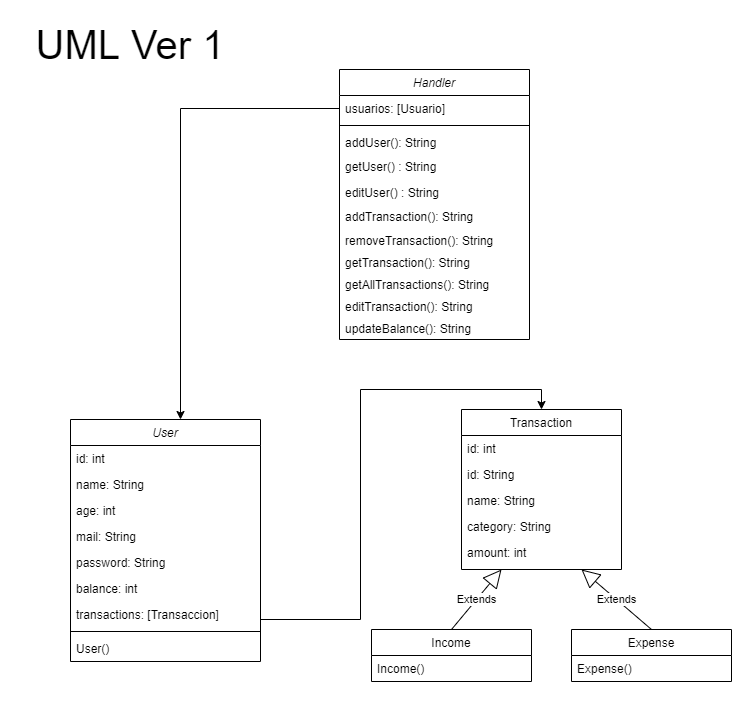
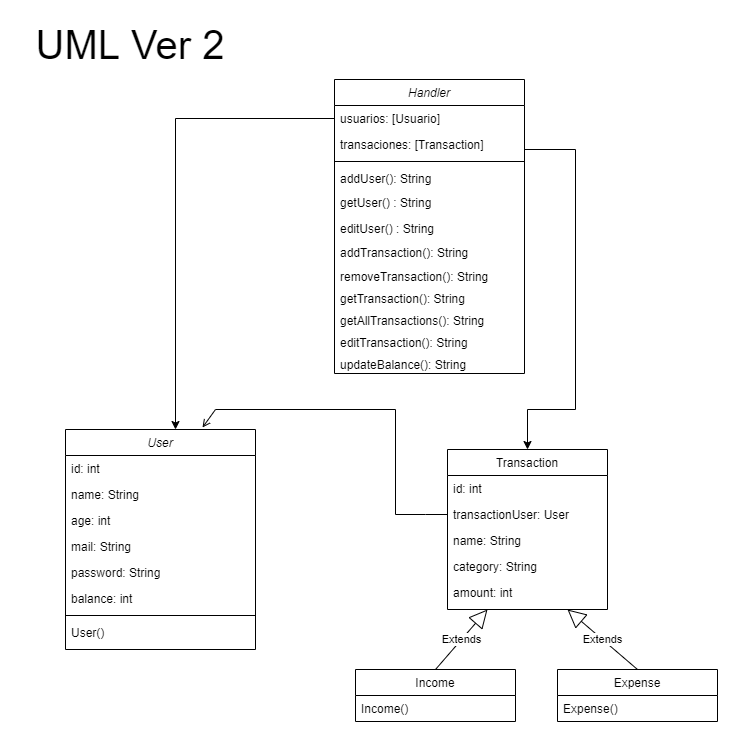
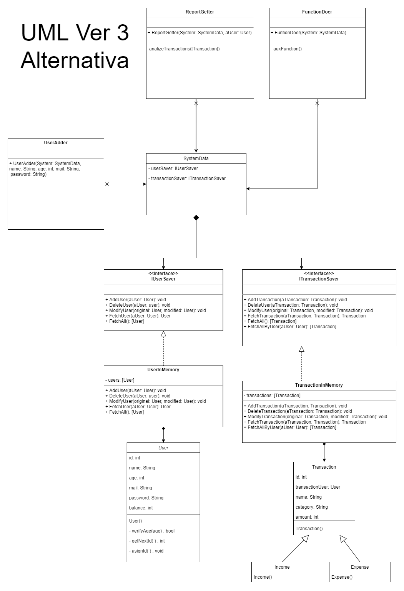
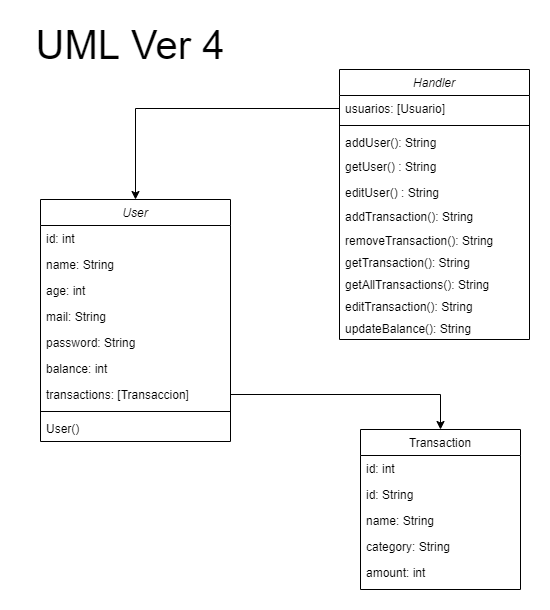

# UML del sistema

Decidimos armar un UML del sistema para planificar en forma correcta los metodos que iba a necesitar cada funcionalidad.
De esta forma logramos un diseño consistente del dominio el cual funciona de forma independiente de la interfaz.

## Version 1
Esta fue la primera versión la cual elaboramos como puntapie inicial.
Consideramos manejar herencia con las transacciones y usar Expense y Income.
También la idea inicial era que el usuario fuera un contenedor de sus propias transacciones.

## Version 2
En la versión 2 decidimos que el handler fuera el que lleve el control tanto de los usuarios como las transacciones y de esta forma lograr que fueran independientes y que las transacciones no dependan del usuario, si bien cada transacción contiene una referencia a un objeto usuario.

## Version 3
En esta versión la idea fue plantear un sistema mas complejo usando interfaz y buenas practicas de diseño. Pero luego abandonamos la idea en post de la simplicidad ya que para los requerimientos que teníamos listados no era necesario elaborar un sistema mas complejo, por lo tanto buscamos priorizar la simplicidad.

## Version 4
Esta fue la versión en la que nos basamos para comenzar con el sistema si bien luego terminamos haciendo algunas modificaciones.

## Version Final
Esta es la versión final del sistema, le agregamos varios metodos y simplificamos la estructura.

